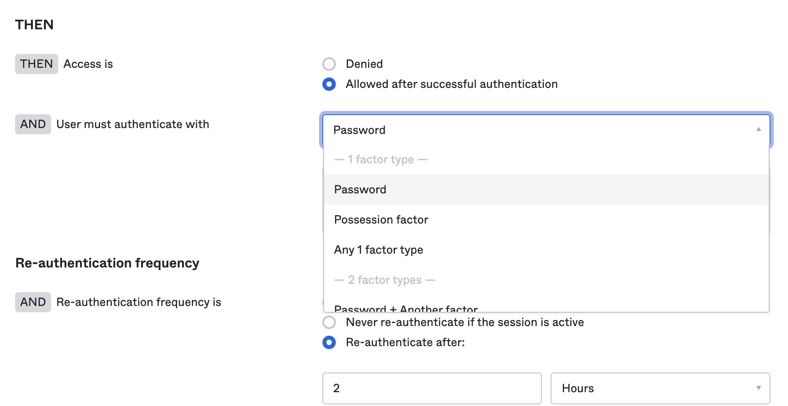
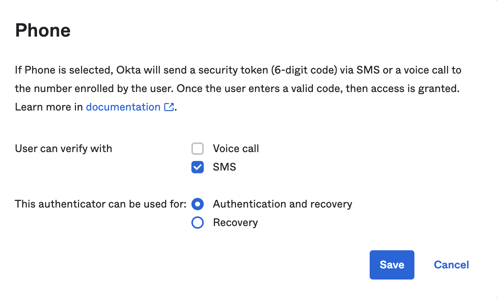
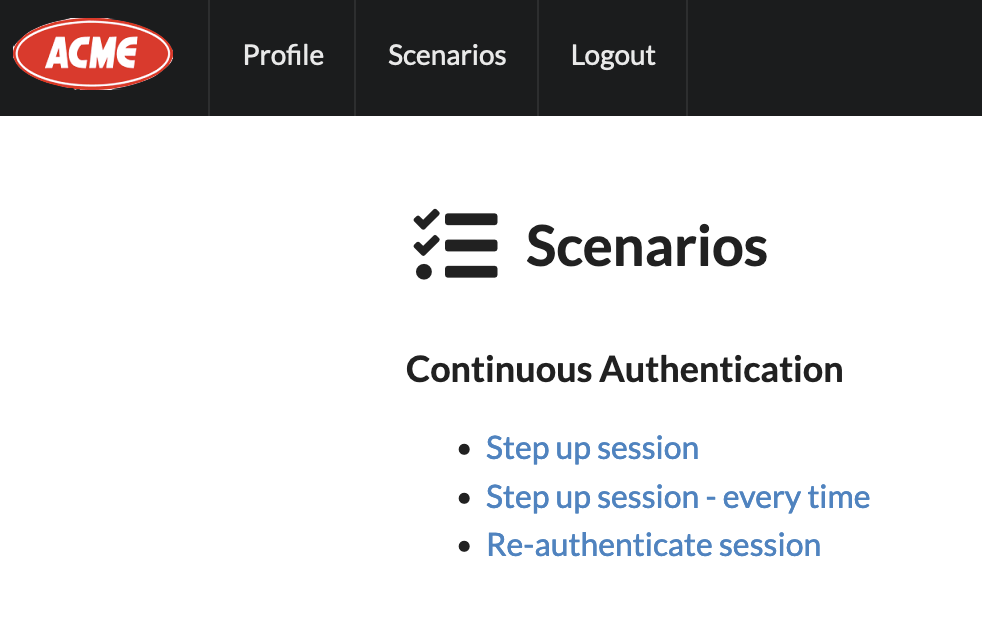

# Sample React application for step-up authentication

This example builds on the following base [sample](https://github.com/okta/samples-js-react). It adds a **Scenario** section to demonstrate different ways of step-up authentication in a OpenID Connect application.


## Configure

* Follow the general steps defined [here](https://github.com/okta/samples-js-react/tree/master/okta-hosted-login) to configure the application and Okta

* Copy the file `okta.env.template` to `.okta.env`. Update the environment values-

    * ISSUER=https://<your_okta_org>/oauth2/<your_okta_authorization_server>
    * CLIENT_ID=<your_app_client_id>
    * STEPUP_LEVEL=urn:okta:loa:2fa:any
    * STEPUP_AGE=30 (No of seconds step up session remains valid)
  
* Ensure that the application sign-on policy is using  `Password` or `Any 1 factor type` as the assurance level



* Ensure that the authenticator `Phone` is enabled for authentication




## Run the Sample

To run this application, install its dependencies:

```
npm install
```

With variables set, start your app:

```
npm start
```

Navigate to http://localhost:3000 in your browser.

If you see a home page that prompts you to login, then things are working!  Clicking the **Log in** button will redirect you to the Okta hosted sign-in page.


## Demonstration

* After successful login with Okta, move to the `Scenarios` tab. 



* Click on each of the following links to test the use case-

  * **Step up session**
  
  * **Step up session - every time**
  
  * **Re-authenticate session**

* To do a clean test for each of the above scenario, logout and re-login before running each case.


